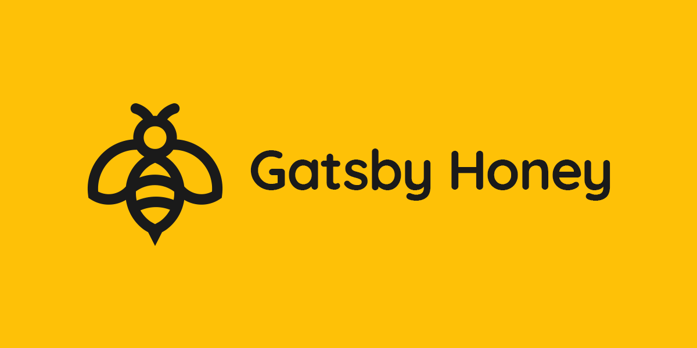

## Gastby Honey

A delicious baseline for Gatsby (v2).

Providing a baseline Gatsby project to quickly and easily build upon, whilst featuring all the requirements a site should have.

[Demo site](https://gatsbyhoney.davshoward.com)

## Features 💪

-   Gastby v2
-   SEO (including robots.txt, sitemap generation, automated yet customisable metadata, and social sharing data)
-   Google Analytics
-   PostCSS support
-   Developer enviornment variables
-   Accessibility support
-   Based on Gatsby Starter Default

## Getting started 📖

1.  **Create a Gatsby site.**

    Use the Gatsby CLI to create a new site, specifying the default starter.

    ```sh
    gatsby new my-honey-starter https://github.com/davshoward/gatsby-starter-honey
    ```

1.  **Start developing.**

    Navigate into your new site’s directory and start it up.

    ```sh
    cd my-honey-starter/
    gatsby develop
    ```

1.  **Open the source code and start editing!**

    Your site is now running at `http://localhost:8000`!

    Open the `my-honey-starter` directory in your code editor of choice and edit `src/pages/index.js`. Save your changes and the browser will update in real time!

## Configuration

Edit and update the root `config.js` file.

## Contributing

Welcome any improvements or suggestions :-)

## Changelog

### 1.1.1

-   CSS variable updates
-   Package updates

### 1.1.0

-   CSS updates
-   Added focus-visible polyfill for improved accessibility
-   Added Icon component for use with SVG
-   Package updates

### 1.0.1

-   Package updates

### 1.0.0

-   Initial commit
